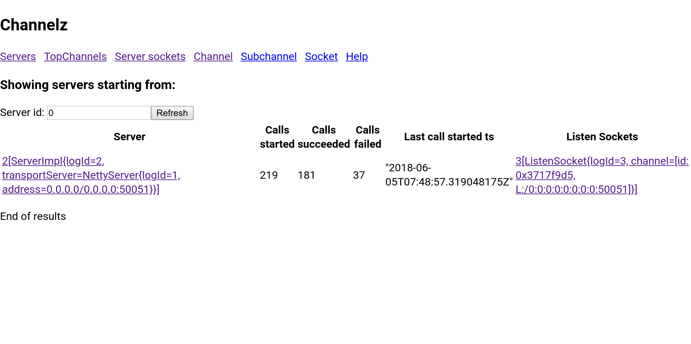

Experimental warning
====================

This tool is a proof of concept, but feedback is welcome.

Description
===========

gRPC provides debug stats in the form of an RPC service. For example,
[channelz](https://github.com/grpc/proposal/blob/master/A14-channelz.md)
is a service that provides channel level debug information. This repo
contains a tool that connects to a remote gRPC `channelz` service and
displays the data as a web page using a local `golang` web server.
The goal is to provide a single CLI tool that can display all gRPC
debug pages.

A screenshot of servers page:


A screenshot of a detailed socket page:


Design
======

The tool has three components:

1. Your web browser.
2. An Envoy proxy to translate gRPC web requests and fetch static
   assets.
3. A web server to serve static assets, namely the Angular app's HTML
   and Javascript files.

When your web browser first hits the Envoy port, the proxy looks at
the content type and determines that it is not a gRPC-web request. As
a result, it routes the request to the static assets web server and
your web browser loads the Angular webapp.

When the web app needs channelz data, it will make gRPC-web requests
to the Envoy port. Envoy uses the content type to detect these
requests to translate and route them to the gRPC host.

For more info look at:
`docker/envoy/zprox.sh`
`web/channelzui/src/app/channelz.service.ts`


Running the tool
================

This example shows how to connect the tool to a gRPC service runnning
[channelz](https://github.com/grpc/proposal/blob/master/A14-channelz.md)
at `127.0.0.1:50051`. The envoy proxy listens on port `9900`.

```bash
# Make sure 'docker-compose' and 'docker' are both available
$ cd docker
$ ./docker/start_docker.sh 9900 127.0.0.1 50051
```


Compile instructions for the web app
====================================

Normally, rebuilding the web app is not necessary. The compiled
javascript and HTML files are already present in the static assets
docker directory.

`npm` is required to be on your `PATH`. This code has been verified to
work with version `5.8.0` of `npm`.

To rebuild and copy the distributable files:

```bash
# Pull the latest proto definitions from
# https://github.com/grpc/grpc-proto
$ buildscripts/channelz_codegen.sh

# Rebuild the angular app
$ buildscripts/update_angular.sh
```
