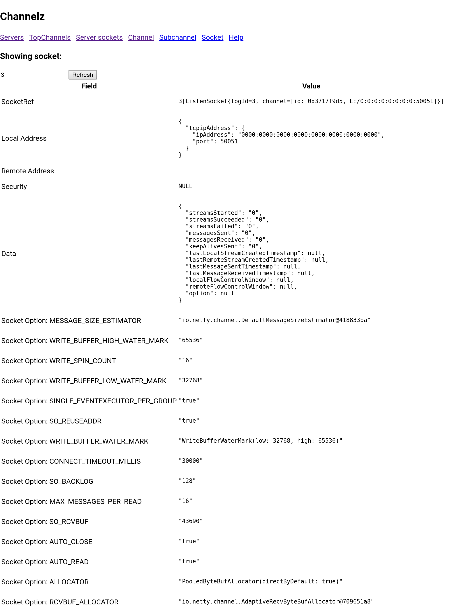

Experimental warning
====================

This tool is a proof of concept, but feedback is welcome.

Description
===========

gRPC provides debug stats in the form of an RPC service. For example,
[channelz](https://github.com/grpc/proposal/blob/master/A14-channelz.md)
is a service that provides channel level debug information. This repo
contains a tool that connects to a remote gRPC `channelz` service and
displays the data as a web page using a local `golang` web server.
The goal is to provide a single CLI tool that can display all gRPC
debug pages.

A screenshot of servers page:


A screenshot of a detailed socket page:


Design
======

The tool has two components: an Angular web app and a CLI tool. The
web app is responsible for the core GUI logic, and the CLI acts as a
proxy that transforms the Angular app's web requests to gRPC
requests. The goal is to do the heavy lifting in the web browser in a
backend agnostic way. Other translation gateways can be created
easily created to suit different operating environments, e.g. as a
shared service or on a web server co-located on the gRPC host. The
complete set of web requests is defined in:

`web/channelzui/src/app/channelz.service.ts`


Running the tool
================

This example shows how to connect the tool to a gRPC service runnning
[channelz](https://github.com/grpc/proposal/blob/master/A14-channelz.md)
at `127.0.0.1:5001`. The local web server runs on port `8080`.

Tip: The `GOPATH` environment variable determines where `go get`
downloads its packages. This is useful if you would like the CLI
tool's dependencies to go to a specific directory.


```bash
$ cd cli
$ go get -u github.com/golang/protobuf/protoc-gen-go
$ go get -u google.golang.org/grpc
$ go run gateway.go -serverAddr=127.0.0.1:50051 -port=8080
```


Compile instructions for the web app
====================================

Normally, rebuilding the web app is not necessary. The compiled
javascript and HTML files are already present in the repo.

`npm` is required to be on your `PATH`. This code has been verified to
work with version `5.8.0` of `npm`.

To rebuild and copy the distributable files:

```bash
$ buildscripts/update_angular.sh
```
